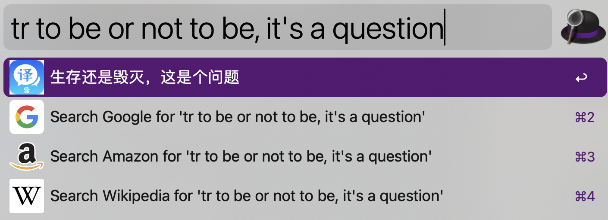
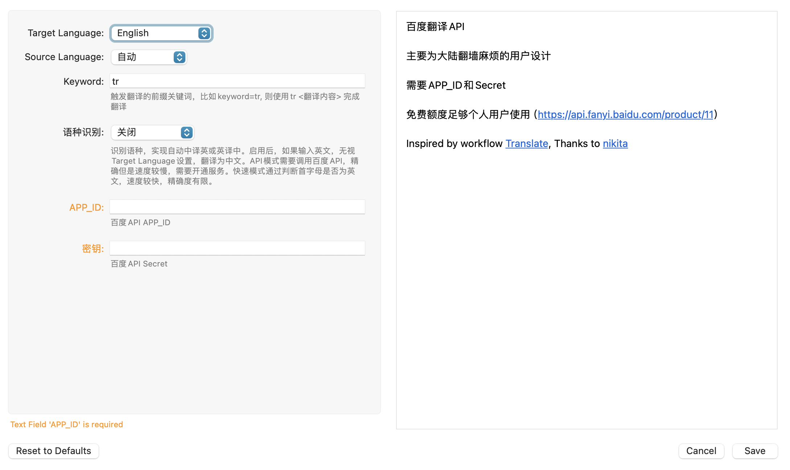

# 百度翻译API

提供命令行版本`translate_terminal.py`和macOS中[Alfred](https://www.alfredapp.com/)软件的workflows版本



## Usage

### Terminal

`python translate.py --source=auto --to=en --auto=2 --appid=<APP_ID> --secret=<secret> text`

### Alfred Workflows



## 参数介绍

### `source` and `to`

可选参数,默认`source = auto`, `to=en`

文本语种和目标语种，具体参考[完整语种列表](https://api.fanyi.baidu.com/product/113)

### 语种识别`auto`

可选参数，智能语种识别，实现中译英英译中

`auto = 0`，关闭模式，不识别语种，将source翻译到target

`auto = 1`，API语种识别模式，通过百度API识别语种，精确度高，较慢；中译英英译中

`auto = 2`，快速模式，通过首字母判断语种，精确度低，速度较快；中译英英译中

### `appid` and `secret`

**必填参数**, 通过[百度翻译开放平台](https://api.fanyi.baidu.com/)注册获得，免费额度足够个人使用（没恰饭）

## Dependencies

To run this project, you will need the following Python libraries installed:  
  
- `requests` for making HTTP requests.  
- `argparse` for command-line option, argument, and sub-command parsing.  
  
```bash  
pip install requests argparse
